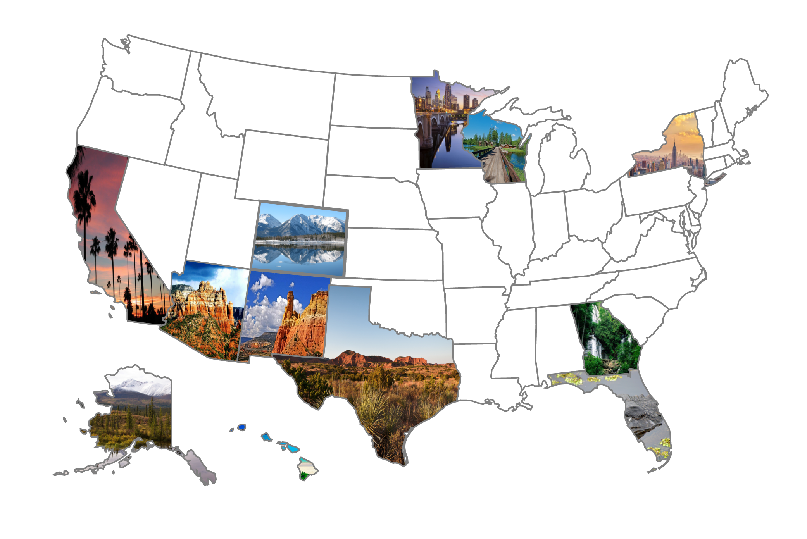

# PhotoMap
### A map to visualize your travels. Show the world where you've been.



# Including PhotoMap In Your HTML File
There are 4 important elements to include in your HTML file in order to use PhotoMap
- The CSS file provided (or modify your own)
- A modified Raphael.js file
- An SVG file containing your map information (in the right format)
- The PhotoMap.js file

Here's a typical import for the SVG map of Norway

```
<link rel = "stylesheet" href = "style.css">      <!-- Add some style -->
<script src = "modifiedRaphael.js"></script>      <!-- Raphael with PhotoMap functionality -->
<script src = "SVGs/norway.js"></script>          <!-- SVG map of Norway -->
<script src = "photoMap.js"></script>             <!-- PhotoMap library -->
```

# Using PhotoMap
Placing a map inside your website is incredibly easy
```
var map = photomap(0, 0, 1000, 1000, norway);
```
Here we are creating a map of Norway at the position x = 0 and y = 0, of canvas size 1000x1000.

If you want to place the map inside div elements, put the name of the div ID instead of the x and y arguments

**HTML**
```
<div id = "mapHolder">
</div>
```

**JavaScript**
```
var map = photomap("mapHolder", 1000, 1000, norway);
```

### A couple notes

- The canvas size of the photomap DOES NOT scale the SVG map, but will instead cut it off if the canvas is too small. In order to prevent this, either increase the size of the canvas or scale the map.
```
// Option 1 - Increase canvas size
map.setSize(1500, 1500);
// Option 2 - Scale the SVG map
map.scale(0.5);
```

- The variable at the end of the constructor (in this case "norway") is simply the variable used in your SVG file. If you don't know the name of the variable and you don't want to look, using the name of the file (no extension & lowercase) is a safe bet. Here's Australia.

```
var map = photomap("mapHolder", 1000, 1000, australia);
```


# The SVG File
This is where all the paths for your maps come from. The format of the SVG file is important, so if you are going to add your own follow the template provided. The IDs correspond to the names of the folders in the "images" folder, which is where your images will be placed. More on this below. Inside the folder 'SVGs' there are many provided maps. If you're looking to speed up performance, it's not a bad idea to delete any of these that you won't be using. 

In order to import SVGs, just place them in that folder.

**Please submit an issue if you notice any SVG maps not working properly**

# Importing Your Images
The goal of PhotoMap is to display your travels in a unique and understandable way. Because of that, it's useful to use images from the places you've been. All of the images used in PhotoMap will be stored in the folder 'images'. Inside here, you'll have to create a bunch of subfolders, each containing the images designated for that particular country/state/region. The names of the folders cannot be random. They must use the names of the paths, provided in your SVG file. The images inside these subfolders should be named in incrementing order, designating when they should appear. So for example, if you had 3 pictures for your trip to Hawaii, they should be named:
`0.jpg`,
`1.jpg`,
`2.jpg`. (The labeling is zero-based)

To summarize:
- The images must be placed in subfolders in the 'images' directory
- The subfolders must be named after the path names
- The images must be labeled in incrementing order starting at 0.jpg

My photos from Hawaii:
```
images/hi/0.jpg
images/hi/1.jpg
images/hi/2.jpg
```

Note: The names of the paths can be confusing for certain SVG maps, so it may be useful to name them something easier to understand. Like changing one of Australia's paths, "AUNSW", to "westernAustralia"

# Slideshow
When elements with images are clicked on, a simple slideshow interface will pop up to allow you to show the images on a bigger screen. An example is shown below


